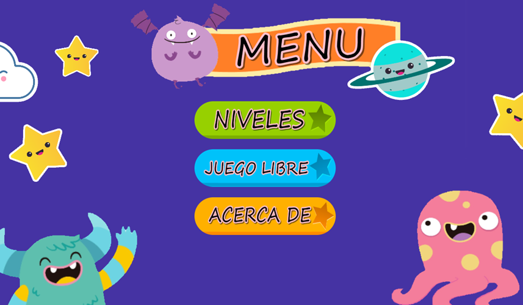
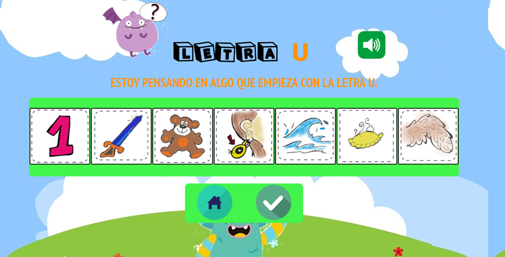
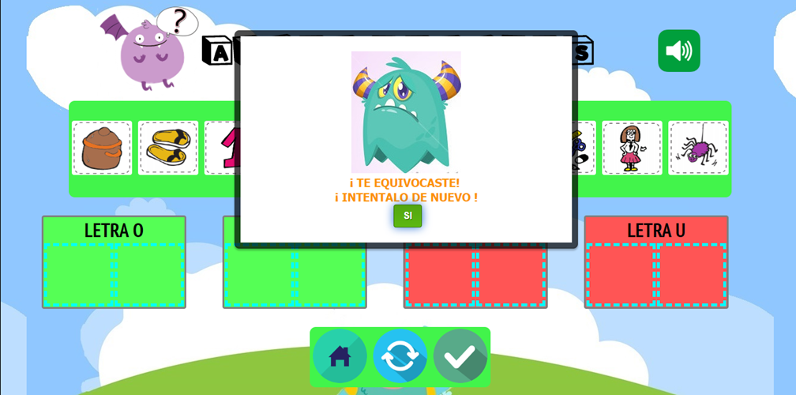

# Actividades DALE!

_Actividades DALE! es una implementación de juegos educativos basado en las tareas de los cuadernillos de juegos de Propuesta DALE!._

## Nuestro Enfoque

_Los juegos educativos digitales pueden servir mucho más que para mero entretenimiento y ocio para los niños, pueden constituir un recurso sumamente importante para prestar atención, agudizar la concentración y memoria, obtener nuevas destrezas, ejercitarse y aprender. Incentiva a la exploración, en ellos se motiva la realización de las actividades, la búsqueda por encontrar y aprender las soluciones correctas, la motivación por el volver a intentar y aprender de los errores y se estimula el interés por avanzar y culminar otras actividades más complejas._

## El software 🚀

_La pantalla principal presenta una serie de opciones que permite al niño/niña elegir libremente que forma de juego prefiere._

_Cada actividad cuenta con una ayuda tanto escrita como auditiva. Es muy intuitiva, diseñada especialmente para que los niños no tengan dificultades al usarla._

_Se incluyeron personajes que acompañan al niño/niña en la realización de las actividades, y le indica si fue realizada satisfactoriamente o necesita intentarlo de nuevo._
_Se presenta una navegación sencilla, con posibilidades de rehacer la actividad, volver a inicio o continuar con la próxima actividad._

_El software en la versión actual incluye las 10 primeras actividades propuestas por el “Cuadernillo de juego de Nivel 1”._

## Para el desarrollo del software se utilizó:    🔧

* [Freepik](https://www.freepik.es/) - Imagenes Monstruos
* [Propuesta DALE!](http://www.propuestadale.com) - Imagenes
* [Freesound](https://freesound.org/browse/) - Sonidos
* [Lujan Rojas](http://github.com/dracaster) - Voz femenina

## Autora ✒️

_Nosotros no somos autores de Propuesta DALE!, ni de los cuadernillos. Nosotros desarrollamos este software como material complementario al propuesto por ellos pero adaptado en formato digital, con la unica finalidad de colaborar con el proyecto, con este software se tiene una versión digitalizada del cuadernillo de juegos de nivel 1._ 

_Diseño, desarrollo, documentación._

* **Luján Rojas** - [Email](lujanrojas.informatica@gmail.com)

## Licencia

 Este trabajo está bajo una licencia <a rel="license" href="http://creativecommons.org/licenses/by-nc-sa/4.0/">Creative Commons Attribution-NonCommercial-ShareAlike 4.0 International License</a>.

## Agradecimientos 🎁

* A Viviana e Ivana Harari, que confiaron en mi para hacer este proyecto tan lindo.
* A los niños y niñas que enseño computación, que me inspiran a hacer estas cosas❤️.
* A los que me alientan dia a dia a seguir aportando a la educación 😊

---

